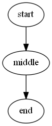
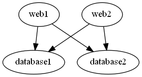
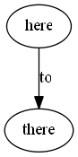

# Edge
This is the most useful of all the helper functions in this module. It is used to define a link between two nodes. This function is also very flexible.

# Basic Syntax
## Edge -From [string] -To [string]
This is the most common way to define an edge in a graph.

    graph g {
        edge -From start -To middle
        edge -From middle To end
    }

We can shorten this syntax by dropping the `-From` and `-To` properties. 

    graph g {
        edge start middle
        edge middle end
    }

These both generate this basic graph:

## Edge [string[]]
If you have a list of things that connect in order, you can specify the entire list.

    graph g {
        edge start,middle,end
    }

This works even better when you have it defined in an array.

    $list = @('start','middle','end')
    graph g {
        edge $list
    }

## Edge -From [string[]] -To [string[]]
Multiple `from` nodes or `to` nodes can be specified at once. Every node in the `from` list will be connected to every node in the `to` list.

    graph g {
       edge -From web1,web2 -To database1,database2
    }

   

   

Just like before, you can drop the `-from` or the `-to` keywords if you prefer. I find myself selectively using them.

# Edge Advanced
The command has several advanced features built into it.

## Edge -Attributes [hashtable]

According to the DOT specification, you can supply several attributes that modify the edge. The most common one is giving it a label.

    graph g {
        edge here there -Attributes @{label='to'}
    }

    graph g {
        edge here there @{label='to'}
    }

You will have to check out the [GraphViz Dot Language reference](https://www.graphviz.org/doc/info/attrs.html) for all the possible attributes. I don't yet validate any of them

The edge command also supports a literal attributes argument in case you would prefer it.

    graph g {
        edge here there -LiteralAttribute '[label="to";]'
    }

## Edge [object[]] -FromScript [scriptblock] -ToScript [scriptblock[]]

This is one really advanced but super powerful features of the edge command. You can specify an input object and then provide script blocks for it to use values off of the object for the `from` and `to` nodes.

Let's assume we have a `$csv` that contains a boss and employee field. We could script it like this:

    graph g {
        $csv | %{edge $_.boss -to $_.employee}
    }

or like this:

    graph g {
        @($csv).ForEach({edge $_.boss -to $_.employee})
    }

But the edge command has aditional support for processing objects and allows you to create it this way:

    graph g{
        edge $csv -FromScript {$_.boss} -ToScript {$_.employee}
    }

This will walk each object and pull those values off of it. The cool thing is that you can run any powershell in those script blocks. You can do API calls or hashtable lookups.

Here is one last example:

    $folder = Get-ChildItem -recurse -directory
    graph g {
        edge $folder -FromScript {$_.parent} -ToScript {$_.name}
    }

## Edge -Attributes @{key=[scriptblock]}

I am not exactly sure if this feature will get wide spread use, but I also support using script blocks in the attribute hashtables.

    $folder = Get-ChildItem -recurse -directory
    graph g {
        edge $folder -FromScript {$_.parent} -ToScript {$_.name} @{label={$_.fullname}}
    }

I was thinking you could add logic in there to change the shape, color or label based on the object.
