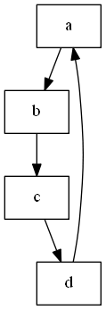

# Inline
This lets you insert native DOT commands into your graph and keep it indented corectly.

    graph g {
        inline 'node [shape="rect";]'
        edge a,b,c,d,a        
    }

If you don't care about the format of the generated DOT file, you could just use normal strings. 

    graph g {
        'node [shape=rect]'
        edge a,b,c,d,a        
    }

The only thing the `inline` command does is place proper indentation into the output. Both of those will render this final image:

