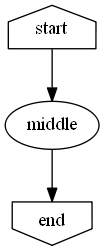
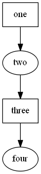

# Node
With the DOT specification, a node will be created any time it is references. So if you create a bunch of edges to nodes, that will create those nodes on the graph.

You use the node command for two reasons. To specify attributes or to place a node in a specific subgraph.

## Node attributes

Here is an example of specifying attributes for a node.

    graph g {
        node start @{shape='house'}
        edge start,middle,end
        node end @{shape='invhouse'}
    }

You can specify multiple nodes at once just like you can edges.

    graph g {
        node one,three @{shape='rectangle'}
        edge one,two,three,four
    }
 

   