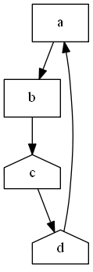

# Node [string[]]
With the DOT specification, a node will be created any time it is references. So if you create a bunch of edges to nodes, that will create those nodes on the graph.

You use the node command for two reasons. To specify attributes or to place a node in a specific subgraph.

## Node [string[]] -Attribute [hashtable]

Here is an example of specifying attributes for a node.

    graph g {
        node start @{shape='house'}
        edge start,middle,end
        node end @{shape='invhouse'}
    }

You can specify multiple nodes at once just like you can edges.

    graph g {
        node one,three @{shape='rectangle'}
        edge one,two,three,four
    }
 

# Node Advanced
## Node [hashtable]
You can specify default node attributes and any node that gets defined down script will inherit those values.

    graph g {
        node @{shape='rectangle'}
        edge a,b,c,a
    }

You can also redefine the default values as you go along. 

   graph g {
        node @{shape='rectangle'}
        edge a,b
        node @{shape='house'}
        edge b,c,d,a
    }

## Node [Object[]] -NodeScript [scriptblock]
Just like with the scripted specification on the `edge`, `node` supports them too.

    graph g {
        node $csv -NodeScript {$_.UserName}
    }

This allows you to pass in the full list of objects and then provide a script to pull the value. This is a very simple example, but this gives you a lot of flexibility. Where you can call any function in line if needed

    graph g {
        node $csv -NodeScript {(Get-ADUser $_.username).name}
    }

## pipeline support
You can pipe objects to the `node` command.

    graph g {
        $csv | node -NodeScript {(Get-ADUser $_.username).name}
    }

I generally don't use this syntax but I wanted to give the user the flexibility. 

## Node -Attribute @{key=[scriptblock]}
This is one of the more creative features on this command. It allows you to specify a `[ScriptBlock]` for object properties.
    
    graph g {
        node $csv -NodeScript {$_.username} @{label={$_.name}}
    }

You can either pull values directly from the object or to a per object calculation. There are lots of use cases for this.

    # more verbose labels
    graph g {
        node $csv -NodeScript {$_.username} @{label={'{0} : {1}' -f $_.name, $_.department}}
    }    

    # using a lookup table
    $colors = @{
        Admin = 'RED'
        'IT' = 'Blue'
    }
    graph g {
        node $csv -NodeScript {$_.username} @{shape='rect';style='filled';color={$colors[$_.department]}}
    }

    # using in line calculations
    graph g {
        node $csv -NodeScript {$_.username} @{shape={if($_.department -eq 'Admin'){'rectangle'}else{'circle'}}}
    }

## [object].Where([ScriptBlock])
This is also a good time to point out that you can use the `Where` function quite nicely with the `node` command. In any cases this will be easyer to work with.

    graph g {
        node $csv.where({$_.department -eq 'Admin'}) -NodeScript {$_.username} @{shape='rect';style='filled';color='Red'}
        node $csv.where({$_.department -eq 'IT'}) -NodeScript {$_.username} @{shape='rect';style='filled';color='Blue'}
    }

But you can still use the classic pipeline to do this too.

    graph g {
        $csv | where department -eq 'Admin' | node -NodeScript {$_.username} @{shape='rect';style='filled';color='Red'}
        $csv | where department -eq 'IT' | node -NodeScript {$_.username} @{shape='rect';style='filled';color='Blue'}
    }

