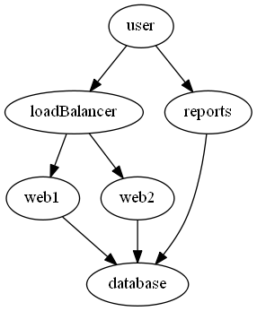
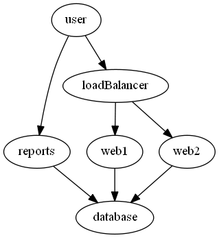

# Rank Advanced

The rank keyword groups object to the same level.

# Rank [string[]]

nodes get placed wherever the engine things is best. The rank command allows you to give it some more layout guidance.

    graph g {
        rank web1,web2,reports
        edge loadBalancer -To web1,web2
        edge user -To loadBalancer,reports
        edge web1,web2,reports -To database
    }

Here is the image without the rank:

Here it is with the rank:

# Scripted properties
Just like with the node and edge commands, you can provide an object and script the properties.

graph g {
    rank $csv -NodeScript {$_.UserName}
}

This was added just to be consistent with the other commands.