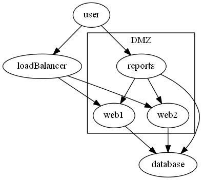

# SubGraph

This allows you to define a graph within the graph. This will group those objects together in some engines.

     graph g {
        subgraph 0 -Attributes @{label='DMZ'} {
            node web1,web2,reports
            edge report -To web1,web2
        }        
        edge loadBalancer -To web1,web2
        edge user -To loadBalancer,report
        edge web1,web2,report -To database
    }

## ID requirements
One special requirement of the subgraph is that it needs a numerical ID. They need to sequential starting from 0.

This does allow you to define parts of the same subgraph in different sections if needed. 

    graph g {
        subgraph 0 -Attributes @{label='DMZ'} {
            node web1,web2            
        }  
        edge report -To web1,web2      
        edge loadBalancer -To web1,web2
        edge user -To loadBalancer,report
        edge web1,web2,report -To database
        subgraph 0 {
             node report
        }
    }