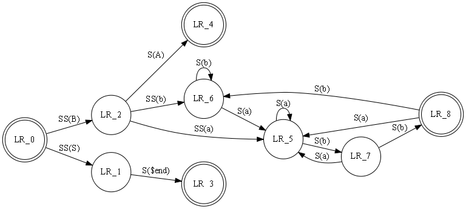

# The Gallery
This is a special example section that tries to recreate some of the diagrams on the [GraphViz Gallery](http://graphviz.org/Gallery.php).

## Cluster
This small example illustrates dot's feature to draw nodes and edges in clusters or separate rectangular layout regions. Clusters are encoded as subgraphs whose names have the prefix 'cluster'. The color attribute of a cluster is interpreted as its outline color or its background color if its style is 'filled'. `Mdiamond` and `Msquare` are modified symbols for data flow diagrams.

    graph g {
        subgraph 0 @{style='filled';color='lightgrey';label='process #1'} {
            node -Default @{style='filled';color='white'}
            edge a0,a1,a2,a3
        }
        subgraph 1 @{label='Process #2';color='blue'} {
            node -Default @{style='filled'}
            edge b0,b1,b2,b3
        }
        edge start -to a0,b0
        edge a1 b3
        edge b2,a3,a0
        edge a3,b3 -to end

        node 'start' @{shape='Mdiamond'}
        node 'end'   @{shape='Msquare'}
    }

## Traffic Lights
"I played some days with making an interface between our ConceptBase system (essentially a database system to store models) and graphviz. One example graph is attached. It is a so-called petri net for Dutch traffic lights. The example is actually taken from a book by Wil van der Aalst." Contributed by Manfred Jeusfeld.

digraph TrafficLights @{
    overlap='false'
    label="PetriNet Model TrafficLights\nExtracted from ConceptBase and layed out by Graphviz"
    fontsize="12"
} {
    node   gy2,yr2,rg2,gy1,yr1,rg1 @{shape='box'}
    node green2,yellow2,red2,safe2,safe1,green1,yellow1,red1 @{shape='circle';fixedsize='true';width='0.9'}
    edge green1,gy1,yellow1,yr1,safe2,rg2,green2,gy2,yellow2,yr2,safe1,rg1,green1
    edge yr1,red1,rg1
    edge yr2,red2,rg2
}  | Export-PSGraph -ShowGraph -LayoutEngine SpringModelSmall

## Entity-Relation Data Model

Layouts made with neato (SpringModelSmall) have the property that all edges tend to have about the same length (unless there is a manual adjustment). By default neato uses randomization, so it makes a different layout each time, but this particular example almost always look well. Edge labels are placed at the edge's midpoint. 

graph ER {
    inline 'edge [arrowsize=0]'
	node course, institute, student @{shape='box'}
	node -default @{shape='ellipse'} 
    node name0, name1, name2 @{label='name'}
    node code, grade, number
	node "C-I","S-C","S-I" @{shape='diamond';style='filled';color='lightgrey'} 

	edge name0 course
	edge code course
	edge course "C-I" @{label="n";len=1.00}
	edge "C-I" institute @{label="1";len=1.00}
	edge institute name1
	edge institute "S-I" @{label="1";len=1.00}
	edge "S-I" student @{label="n";len=1.00}
	edge student -To grade,name2,number
	edge student "S-C" @{label="m";len=1.00}
	edge "S-C" course @{label="n";len=1.00}

	inline 'label = "\n\nEntity Relation Diagram\ndrawn by NEATO"'
	inline 'fontsize=20'
} | Export-PSGraph -ShowGraph -LayoutEngine SpringModelSmall

## Finite Automaton
This is a drawing of a finite automaton. The rankdir and orientation request a left-to-right drawing in landscape mode. Note the use of text labels on edges.

    digraph finite_state_machine @{rankdir='LR';size=8.5} {
        node  LR_0,LR_3,LR_4,LR_8 @{shape='doublecircle'}
        node -default @{shape = 'circle'}
        edge LR_0 LR_2 @{ label = "SS(B)" }
        edge LR_0 LR_1 @{ label = "SS(S)" }
        edge LR_1 LR_3 @{ label = 'S($end)' }
        edge LR_2 LR_6 @{ label = "SS(b)" }
        edge LR_2 LR_5 @{ label = "SS(a)" }
        edge LR_2 LR_4 @{ label = "S(A)" }
        edge LR_5 LR_7 @{ label = "S(b)" }
        edge LR_5 LR_5 @{ label = "S(a)" }
        edge LR_6 LR_6 @{ label = "S(b)" }
        edge LR_6 LR_5 @{ label = "S(a)" }
        edge LR_7 LR_8 @{ label = "S(b)" }
        edge LR_7 LR_5 @{ label = "S(a)" }
        edge LR_8 LR_6 @{ label = "S(b)" }
        edge LR_8 LR_5 @{ label = "S(a)" }
    }  | Export-PSGraph -ShowGraph

