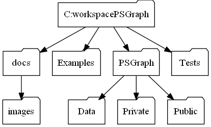
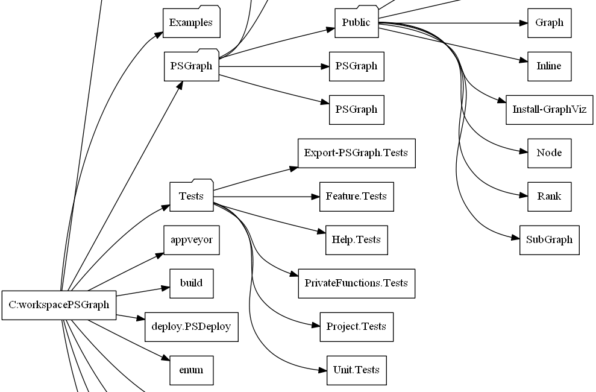
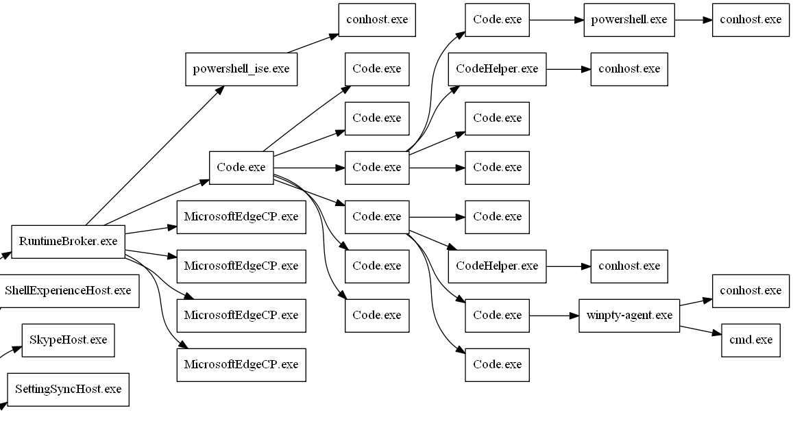
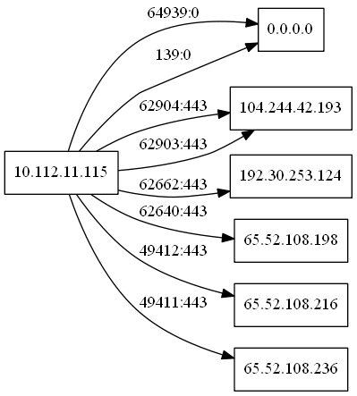
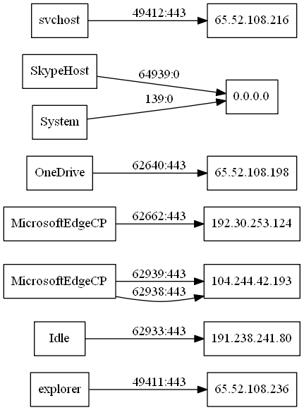
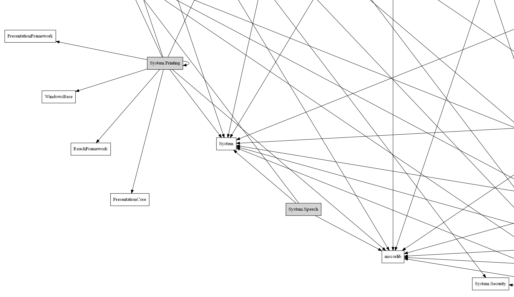

# Scripted Examples
Here are the examples that really show off what this module can do. Here I take some simple sets of data that is related in some way and quickly build complex graphs with very few lines of code.

## Folder Structure

This first example walk the folder structure and displays it as a tree graph. This is a typical hierarchal pattern that is easy to relat to.

    $folders = Get-ChildItem C:\workspace\PSGraph -Directory -Recurse

    graph folders {
        node @{shape='folder'}
        node $folders -NodeScript {$_.fullname} @{label={$_.basename}}
        edge $folders -FromScript {split-path $_.fullname} -ToScript {$_.fullname}
    } | Export-PSGraph -ShowGraph 

This one also includes the files in the folder. Click on the image to see the whole chart. I used the `rankdir='LR'` to make it flow from left to right.

    $files = Get-ChildItem C:\workspace\PSGraph -Recurse
    graph folders  @{rankdir='LR'} {
        node @{shape='box'}
        node $files.Where({$_.PSIsContainer}).FullName @{shape='folder'}
        node $files -NodeScript {$_.fullname} @{label={$_.basename}}
        edge $files -FromScript {split-path $_.fullname} -ToScript {$_.fullname}
    } | Export-PSGraph -ShowGraph 

## Process info
Because processors have owners, we can also chart the relationships between them. Click on the image to view the whole chart.

    $process = Get-CimInstance -ClassName CIM_Process

    graph processes @{rankdir='LR'} {
        node @{shape='box'}
        node $process -NodeScript {$_.ProcessId} -Attributes @{label={$_.ProcessName}}
        edge $process -FromScript {$_.ParentProcessId} -ToScript {$_.ProcessId}
    } | Export-PSGraph -ShowGraph 

## Network Connections
Here is a mapping of active network connections from one machine to everything it is connected to.

    $netstat = Get-NetTCPConnection | where LocalAddress -EQ '10.112.11.115'

    graph network @{rankdir='LR'}  {
        node @{shape='rect'}
        edge $netstat -FromScript {$_.LocalAddress} -ToScript {$_.RemoteAddress} @{label={'{0}:{1}' -f $_.LocalPort,$_.RemotePort}}
    } | Export-PSGraph -ShowGraph 

We can take it the next step and map our processes to a network connection.

    $netstat = Get-NetTCPConnection | where LocalAddress -EQ '10.112.11.115'
    $process = Get-Process | where id -in $netstat.OwningProcess

    graph network @{rankdir='LR'}  {
        node @{shape='rect'}
        node $process -NodeScript {$_.ID} @{label={$_.ProcessName}}
        edge $netstat -FromScript {$_.OwningProcess} -ToScript {$_.RemoteAddress} @{label={'{0}:{1}' -f $_.LocalPort,$_.RemotePort}}
    } | Export-PSGraph -ShowGraph 

## Assembly Information
We can also map assembly dependencies on each other.

This one maps several things in a folder. It also fills in the local assemblies to make it easier to spot external references. This one gets complicated fast if you parse an entire folder. 

    $files = Get-ChildItem 'C:\Program Files\Reference Assemblies\Microsoft\Framework\v3.0\System.*' -file -Filter *.dll
    $loaded  = $files | %{[reflection.assembly]::LoadFile($_.FullName)}

    graph assemblies @{rankdir='LR'} {
        node @{shape='rect'}
        node $loaded -NodeScript {$_.getName().name} @{style='filled'}
        edge $loaded -FromScript {$_.getName().name} -ToScript {$_.GetReferencedAssemblies().name}
    } | Export-PSGraph -ShowGraph -LayoutEngine Circular

